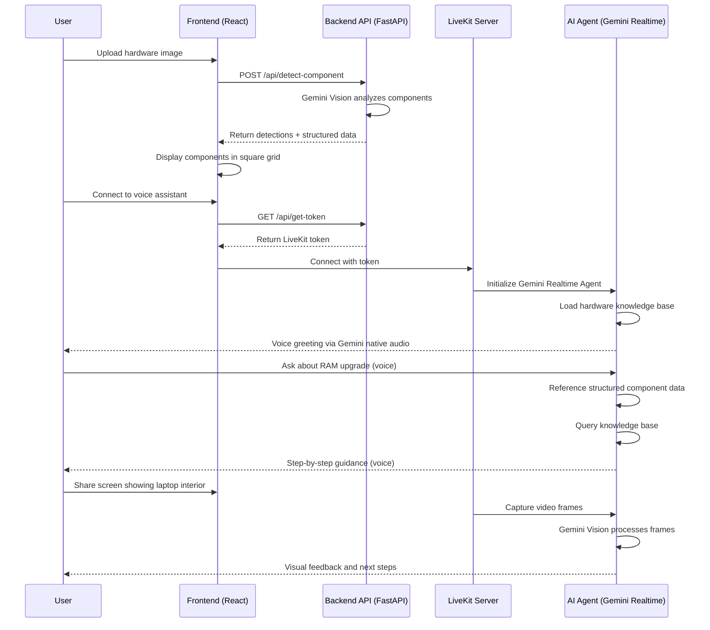

# Hardware Upgrade Assistant - Multimodal AI Agent

An AI-powered hardware upgrade assistant that uses **Gemini Realtime API** for voice interaction and **Gemini Vision** for component detection. This multimodal AI agent guides users through laptop and desktop hardware upgrades including RAM, battery, SSD, and WiFi card replacements with step-by-step visual assistance.

## 🎯 Features

- **🎙️ Voice-First Interaction**: Gemini Realtime API with native audio (no separate TTS/STT needed)
- **👁️ Component Detection**: Gemini Vision AI analyzes hardware images to identify upgradeable components
- **📊 Structured Guidance**: Component arrays with detailed recommendations and next-steps
- **🎨 Modern UI**: Dark theme square grid layout with dropdown accordions
- **📹 Video Support**: LiveKit integration for screen sharing and real-time assistance
- **📚 Knowledge Base**: 6 comprehensive guides covering procedures, troubleshooting, tools, and safety
- **🔍 Image Analysis**: Upload hardware images for instant component identification
- **🛡️ Safety-First**: Built-in safety reminders and anti-static precautions

## 🏗️ Architecture

The application consists of four main components:

1. **Frontend (React + TypeScript)**: Modern UI with LiveKit video components and image upload
2. **Backend API (FastAPI)**: REST API for component detection and LiveKit token generation
3. **LiveKit Server**: Real-time infrastructure for voice/video streaming
4. **AI Agent**: Gemini Realtime API for conversational assistance with hardware knowledge



## 🚀 Quick Start

### Prerequisites

- Python 3.12+
- Node.js 18+
- LiveKit Cloud account or self-hosted server
- Google AI Studio API key (for Gemini)

### Environment Setup

1. Clone the repository:
```bash
git clone https://github.com/harithebeast/Hardware_assitant_multimodal.git
cd Hardware_assitant_multimodal
```

2. Create `.env` file in the root directory:
```bash
# LiveKit Configuration
LIVEKIT_API_KEY=your_livekit_api_key
LIVEKIT_API_SECRET=your_livekit_api_secret
LIVEKIT_URL=wss://your-livekit-server.livekit.cloud

# Google Gemini API
GOOGLE_API_KEY=your_google_ai_studio_api_key
GEMINI_MODEL=gemini-live-2.5-flash-preview

# Langfuse (Optional - for tracing)
LANGFUSE_PUBLIC_KEY=your_langfuse_public_key
LANGFUSE_SECRET_KEY=your_langfuse_secret_key
LANGFUSE_HOST=https://cloud.langfuse.com

# Disable inference if on Windows (optional)
LIVEKIT_DISABLE_INFERENCE=1
```

### Backend Setup

1. Navigate to the backend directory:
```bash
cd backend
```

2. Create and activate virtual environment:
```bash
python -m venv .venv
.venv\Scripts\activate  # On Windows
# source .venv/bin/activate  # On Linux/Mac
```

3. Install dependencies:
```bash
pip install -r requirements.txt
```

4. Start the FastAPI server:
```bash
python api.py
```

5. In a separate terminal, start the LiveKit agent:
```bash
python video_agent.py dev
```

### Frontend Setup

1. Navigate to the frontend directory:
```bash
cd ../frontend
```

2. Install dependencies:
```bash
npm install
```

3. Start the development server:
```bash
npm run dev
```

4. Open your browser to `http://localhost:5173`

## 📖 Usage

### Component Detection
1. **Upload Image**: Click "Upload Image" and select a photo of laptop/desktop internals
2. **View Analysis**: Components appear in square grid with color-coded status:
   - 🟢 **Green**: Confirmed components detected
   - 🟠 **Orange**: Components not visible in image
   - 🔵 **Blue**: Additional notes and observations
3. **Review Recommendations**: Expand dropdown accordions to see upgrade instructions

### Voice Assistant
1. **Connect**: Enter your name and click "Connect to Room"
2. **Voice Interaction**: The Gemini Realtime agent will greet you
3. **Ask Questions**: 
   - "How do I upgrade my laptop RAM?"
   - "Is my battery replaceable?"
   - "What tools do I need for SSD installation?"
4. **Screen Share**: Share your screen showing hardware for visual guidance
5. **Step-by-Step**: Agent guides you one step at a time with confirmations

### Example Workflows

**Workflow 1: RAM Upgrade Planning**
1. Upload image of laptop RAM
2. Agent detects: "DDR4 SO-DIMM, 8GB, 2 slots"
3. Review structured recommendations
4. Ask via voice: "What RAM is compatible?"
5. Agent provides specifications and purchase links

**Workflow 2: Battery Replacement**
1. Connect to voice assistant
2. Share screen showing laptop model
3. Ask: "How do I replace my battery?"
4. Agent guides through:
   - Safety precautions
   - Required tools
   - Step-by-step disassembly
   - Installation procedure
   - Testing

## 🔑 Key Components

### Video Agent (`backend/video_agent.py`)

The core AI agent powered by **Gemini Realtime API**:
- **Native Voice I/O**: No separate STT/TTS needed
- **Video Frame Processing**: Captures screen shares at 1fps
- **Knowledge Integration**: 6 comprehensive hardware guides
- **Multimodal Context**: Combines voice, video, and structured data
- **Voice**: Puck (natural, conversational)
- **Temperature**: 0.8 (balanced creativity)

### Component Detector (`backend/component_detector.py`)

Gemini Vision-based hardware detection:
- **Image Analysis**: Identifies RAM, battery, SSD, WiFi cards
- **Structured Output**: Component arrays with compatibility recommendations
- **Visual Annotations**: Gemini-based text descriptions (YOLO commented out temporarily)
- **Next Steps**: Detailed hardware upgrade procedures per component

### API Server (`backend/api.py`)

FastAPI server providing:
- **`POST /api/detect-component`**: Upload image for component detection
  - Input: multipart/form-data with image file
  - Output: JSON with detections array and annotated image
- **`GET /api/get-token`**: Generate LiveKit room tokens
  - Params: participant name
  - Output: Room token for video agent connection
- **`GET /api/model-info`**: Current detection model status
  - Output: Model name and availability flags
- CORS enabled for local frontend development

### Component Detector (`backend/component_detector.py`)

Hybrid detection system (currently using Gemini-only):
- **Gemini Vision**: Primary detection using gemini-2.0-flash-exp-vision
- **YOLO Detection**: Commented out temporarily (can re-enable later)
- **Image Processing**: Resizing, annotation, base64 encoding
- **Detection Output**: Component names, confidence scores, recommendations

### Knowledge Manager (`backend/knowledge_manager.py`)

Manages hardware-specific knowledge domains:
- **`dashboard.md`**: RAM, battery, SSD, WiFi upgrade procedures
- **`export.md`**: Component compatibility and selection guides
- **`permissions.md`**: Visual component identification with images
- Additional domains can be added as markdown files

### Frontend (`frontend/src/App.tsx`)

React + TypeScript application:
- **Image Upload**: Drag-and-drop component detection interface
- **Square Grid Layout**: Responsive design (2/4/6/8 columns)
- **Dropdown Accordions**: Collapsible upgrade instructions per component
- **LiveKit Integration**: Real-time voice/video with hardware assistant
- **Dark Theme**: Professional UI (#1a1a1a, #252525, #404040)

## 📚 Knowledge Base

The knowledge base provides domain-specific hardware assistance:

- **Upgrade Procedures** (`backend/knowledge/dashboard.md`): RAM, battery, SSD, WiFi card replacement
- **Compatibility Guides** (`backend/knowledge/export.md`): Component selection and matching
- **Visual Identification** (`backend/knowledge/permissions.md`): How to identify laptop components

## Customization

### Swapping AI Components

The agent uses LiveKit's plugin system with Google Gemini:

```python
# STT Provider (currently Deepgram)
from livekit.plugins import deepgram
stt=deepgram.STT()

# Change to AssemblyAI if needed:
# from livekit.plugins import assemblyai
# stt=assemblyai.STT()

# LLM Provider (Gemini Realtime API)
from livekit.plugins import google
llm=google.realtime.RealtimeModel(
    model="gemini-live-2.5-flash-preview",
    voice="Puck",  # Choose from available voices
    temperature=0.8
)

# TTS is handled by Gemini native audio (no separate TTS plugin)
```

### Re-enabling YOLO Detection

To use hybrid YOLO + Gemini detection:

1. Uncomment YOLO imports in `backend/component_detector.py` (lines 14-20)
2. Set `YOLO_AVAILABLE = True`
3. Uncomment YOLO model loading in `__init__()` (lines 36-51)
4. Uncomment YOLO detection logic in `detect_components()` (lines 80-160)
5. Ensure `RepairMate/weights/best.pt` exists with your trained model

### Adding Knowledge Domains

1. Create a new markdown file in `backend/knowledge/` (e.g., `bios.md`)
2. Update the `knowledge_files` mapping in `knowledge_manager.py`:
   ```python
   knowledge_files = {
       "dashboard": "dashboard.md",
       "export": "export.md", 
       "permissions": "permissions.md",
       "bios": "bios.md"  # Add your new domain
   }
   ```
3. The agent will automatically include it in conversation context

### Modifying Agent Behavior

Update the `INSTRUCTIONS` constant in `video_agent.py` (lines 82-108) to:
- Change personality and tone
- Add new capabilities or restrictions
- Focus on different hardware types
- Adjust technical depth level

## Observability

The application integrates with Langfuse for comprehensive monitoring:

- **Traces**: Complete conversation flows with timing analysis
- **Spans**: Individual component performance (STT, LLM, VAD)
- **Generations**: LLM inputs/outputs with token usage
- **Error Tracking**: Detailed error logging for debugging

Configure Langfuse in `backend/.env`:
```bash
LANGFUSE_PUBLIC_KEY=pk-lf-...
LANGFUSE_SECRET_KEY=sk-lf-...
LANGFUSE_HOST=https://cloud.langfuse.com
```

Access your Langfuse dashboard to monitor agent performance and optimize responses.

## Troubleshooting

### Component Detection Not Working

1. **Check API Server**: Ensure `python backend/api.py` is running on port 8000
2. **Verify Environment**: Confirm `GOOGLE_API_KEY` exists in `backend/.env`
3. **Test Endpoint**: Visit `http://localhost:8000/api/model-info` to verify model status
4. **Check CORS**: Frontend must be on same origin or CORS must be configured
5. **Image Format**: Ensure uploaded images are JPEG/PNG and under 10MB

### Agent Not Responding

1. **LiveKit Connection**: Verify `LIVEKIT_URL` and `LIVEKIT_API_KEY` in `.env`
2. **Gemini API**: Check `GOOGLE_API_KEY` is valid and has Realtime API access
3. **Microphone Access**: Browser must have microphone permissions
4. **Token Generation**: Test `/api/get-token` endpoint returns valid tokens

### YOLO Re-enablement Issues

1. **Model Path**: Ensure `RepairMate/weights/best.pt` exists
2. **Ultralytics**: Verify `ultralytics` and `opencv-python` are installed
3. **YOLO_AVAILABLE**: Set to `True` in `component_detector.py`
4. **Uncomment Code**: Remove comment markers from lines 14-20, 36-51, 80-160, 162-208

### Audio Issues

- **No Voice Output**: Gemini native audio should work automatically (TTS=None)
- **Microphone Not Detected**: Check browser permissions and Deepgram STT configuration
- **Echo/Feedback**: Use headphones or adjust VAD sensitivity in `video_agent.py`

## Production Considerations

- **Environment Variables**: Use secure secret management (not .env files)
- **Error Handling**: All API endpoints have comprehensive error recovery
- **Rate Limiting**: Monitor Gemini API quota usage
- **Scaling**: Deploy LiveKit server cluster for multiple concurrent users
- **Security**: Update CORS origins for production domains
- **Monitoring**: Enable Langfuse traces for production debugging
- **Model Hosting**: Consider hosting YOLO model on cloud storage

## API Dependencies

This project requires API keys from:

- **LiveKit**: Real-time video/audio infrastructure (`LIVEKIT_URL`, `LIVEKIT_API_KEY`, `LIVEKIT_API_SECRET`)
- **Google Gemini**: Vision detection and Realtime voice AI (`GOOGLE_API_KEY`)
- **Deepgram**: Speech-to-text transcription (`DEEPGRAM_API_KEY`)
- **Langfuse**: Observability and monitoring (optional) (`LANGFUSE_PUBLIC_KEY`, `LANGFUSE_SECRET_KEY`)

All services offer free tiers for development and testing.

## Business Applications

This technology enables various hardware support use cases:

- **Laptop Upgrade Consulting**: Visual component identification and compatibility checking
- **Remote Hardware Support**: Diagnose and guide users through repairs
- **E-commerce Integration**: Help customers choose compatible upgrade components
- **Technical Training**: Interactive hardware identification tutorials
- **Warranty Services**: Visual damage assessment and repair guidance

## Project Structure

```
livekit-video/
├── backend/
│   ├── api.py                     # FastAPI server with detection endpoints
│   ├── video_agent.py             # LiveKit voice agent with Gemini Realtime
│   ├── component_detector.py      # Hybrid YOLO/Gemini detection (YOLO commented)
│   ├── knowledge_manager.py       # Hardware knowledge base loader
│   ├── requirements.txt           # Python dependencies
│   └── knowledge/                 # Hardware upgrade guides (markdown)
│       ├── dashboard.md           # RAM, battery, SSD, WiFi procedures
│       ├── export.md              # Compatibility guides
│       └── permissions.md         # Visual component identification
├── frontend/
│   ├── src/
│   │   ├── App.tsx                # React main component with LiveKit
│   │   ├── main.tsx               # Entry point
│   │   └── *.css                  # Styling
│   ├── package.json               # Node.js dependencies
│   └── vite.config.ts             # Vite configuration
└── README.md                      # This file
```

## License

MIT License - Feel free to use and modify for your projects.

## Contributing

Contributions welcome! Please:
1. Fork the repository
2. Create a feature branch (`git checkout -b feature/amazing-feature`)
3. Commit your changes (`git commit -m 'Add amazing feature'`)
4. Push to the branch (`git push origin feature/amazing-feature`)
5. Open a Pull Request

## Support

- **Issues**: [GitHub Issues](https://github.com/harithebeast/Hardware_assitant_multimodal/issues)
- **LiveKit Docs**: [docs.livekit.io](https://docs.livekit.io/)
- **Gemini API Docs**: [ai.google.dev](https://ai.google.dev/)